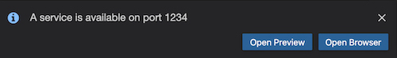

Example of NEAR Wallet integration - Gitpod version
===================================================

This example demonstrates how to integrate your application with NEAR Wallet.
The contract is quite simple. It can store the account_id of last sender and return it. It also shows how you can debug contracts using logs.

**Note**: this README is specific to Gitpod and this example. For local development, please see [README.md](README.md).

## Getting started

Gitpod has taken care of installing all the necessary tools and dependencies. At the bottom of Gitpod is a terminal which will display a link to follow:
```bash
Server running at http://localhost:1234
```

A small dialog may appear showing options similar to this:



The "Preview" option will open the site in a tab within the IDE. Note that Gitpod may need a little time to spin up the website. It's possible this step might require reloading after a brief pause.

## To Test

```
yarn asp // as-pect tests
yarn jest // integration tests
yarn test // both
```

## To Explore

- `assembly/main.ts` for the contract code
- `src/index.html` for the front-end HTML
- `src/main.js` for the JavaScript front-end code and how to integrate contracts
- `src/test.js` for the JS tests for the contract
